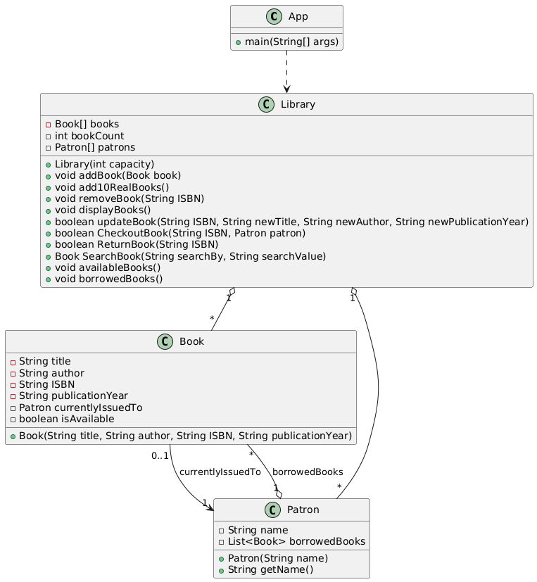

# Library-Management-System

A Java based Library Management System to practice Object-Oriented Programming (OOP), SOLID principles, and relevant design patterns.

This is a simple Library Management System, that could be used by a librarian.
